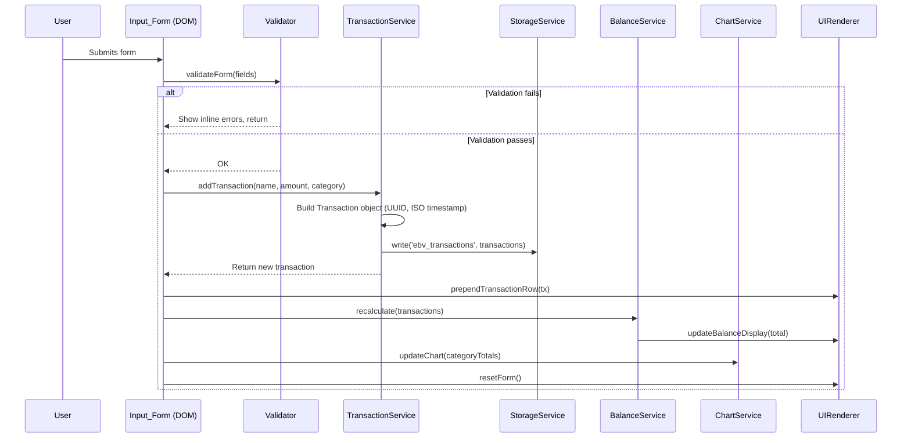

# Design Document — Expense & Budget Visualizer

## Overview

The Expense & Budget Visualizer is a zero-dependency, single-page web application (SPA) that lets students record and analyse daily spending. The entire implementation lives in three static files — `index.html`, `css/style.css`, and `js/app.js` — so it can be deployed directly to GitHub Pages with no build step.

The application is deliberately framework-free. All state management, DOM manipulation, event handling, and persistence are handled with Vanilla JavaScript. The only external dependency is Chart.js, loaded via a CDN `<script>` tag at runtime, which renders the spending pie chart.

### Key design goals

- **Offline-capable persistence**: transactions, custom categories, and the user's theme preference are all stored in `localStorage` under well-defined keys.
- **Immediate, reactive UI**: every mutation (add, delete, sort, theme change) synchronously updates all affected parts of the DOM without page reloads.
- **Progressive disclosure of optional features**: custom categories, sort control, and dark/light theme toggle are all included and gated only by the presence of their UI elements.
- **Accessible and responsive**: WCAG 2.1 AA contrast, 44 × 44 px minimum touch targets, and a mobile-first layout that switches from single-column to two-column at 768 px.

---

## Architecture

The app follows a simple **event-driven MVC-lite** pattern without any framework. The three files map roughly to:

```
index.html    ← View (structure)
css/style.css ← View (presentation)
js/app.js     ← Controller + Model
```

### Module decomposition inside `js/app.js`

`app.js` is organised into cohesive, named function groups. There is no module bundler, so all groups share a single script scope. To avoid naming collisions and make the intent clear, each group is wrapped in a plain object literal (namespace pattern):

```
StorageService     — read / write / clear localStorage keys
TransactionService — CRUD for transactions, enforces business rules
CategoryService    — CRUD for categories, merges defaults with custom
Validator          — pure validation functions (return error strings or null)
BalanceService     — computes formatted balance from a transaction array
SortService        — sorts a transaction array by the active sort option
ChartService       — wraps Chart.js instance lifecycle (create, update, destroy)
ThemeService       — reads, writes, and applies the active theme
UIRenderer         — reads from service state and updates the DOM
App (init)         — bootstraps everything on DOMContentLoaded
```

### Data flow

```
User interaction
       │
       ▼
  Event listener (in App / UIRenderer)
       │
       ▼
  Service mutation (TransactionService, CategoryService, etc.)
       │
       ├──▶ StorageService.write(...)
       │
       └──▶ UIRenderer.render*()   ──▶  DOM update
                    │
                    └──▶ ChartService.update(...)  ──▶  Chart.js
```

All service state is held in module-level variables (arrays and primitives). There is no central store — each service owns its slice of state.

### Sequence diagram — add transaction



---

## Components and Interfaces

### 1. StorageService

Responsible for all `localStorage` I/O. Isolates storage errors so callers receive `null` on read failure and a boolean on write failure.

```javascript
StorageService = {
  read(key)          // → parsed value | null
  write(key, value)  // → boolean (true = success)
  remove(key)        // → void
}
```

Keys used:

| Key | Type | Description |
|---|---|---|
| `ebv_transactions` | `Transaction[]` JSON | Persisted transaction list |
| `ebv_categories` | `string[]` JSON | Custom category labels |
| `ebv_theme` | `"light" \| "dark"` | Active theme |

### 2. TransactionService

Owns the in-memory transaction array. All mutations go through this service.

```javascript
TransactionService = {
  init(transactions)          // → void  (load from storage on boot)
  getAll()                    // → Transaction[]
  add(name, amount, category) // → Transaction  (generates id + timestamp)
  remove(id)                  // → boolean
  getCategoryTotals()         // → { [category: string]: number }
}
```

A `Transaction` object has the shape:

```javascript
{
  id:        string,   // UUID v4
  name:      string,   // 1–100 chars
  amount:    number,   // 0.01 – 999,999,999.99
  category:  string,   // 1–50 chars
  timestamp: string    // ISO 8601 date-time
}
```

### 3. CategoryService

Owns the merged (default + custom) category list.

```javascript
CategoryService = {
  init(customFromStorage) // → void
  getAll()                // → string[]
  getCustom()             // → string[]  (excludes defaults)
  add(label)              // → { ok: boolean, error?: string }
  remove(label)           // → { ok: boolean, error?: string }
  isReferenced(label)     // → boolean  (checks TransactionService)
}
```

Default categories (always present, cannot be deleted): `["Food", "Transport", "Fun"]`.

### 4. Validator

Pure functions that return an error string on failure or `null` on success.

```javascript
Validator = {
  validateName(value)       // → string | null
  validateAmount(value)     // → string | null
  validateCategory(value)   // → string | null
  validateCategoryLabel(label, existingLabels) // → string | null
  validateForm(fields)      // → { [fieldName]: string | null }
}
```

### 5. BalanceService

```javascript
BalanceService = {
  compute(transactions) // → number  (sum, rounded half-up to 2 dp)
  format(number)        // → string  (e.g. "Rp 12,345.67" or "-Rp 12.00")
}
```

Rounding uses the half-up algorithm: `Math.round(value * 100) / 100`.

### 6. SortService

```javascript
SortService = {
  sort(transactions, option) // → Transaction[]  (sorted copy, originals untouched)
}
// option: 'amount-asc' | 'amount-desc' | 'category-asc' | 'category-desc' | null
// null = chronological descending (default)
```

Ties within amount or category sort are broken by `timestamp` descending.

### 7. ChartService

Wraps the Chart.js instance. Holds a reference to the single pie chart.

```javascript
ChartService = {
  init(canvasEl)                  // → void  (creates Chart.js instance)
  update(categoryTotals)          // → void  (destroys and re-creates or calls .update())
  assignColours(categories)       // → string[]  (deterministic, unique hex colours)
}
```

`assignColours` uses a pre-defined palette of at least 20 visually distinct colours. When more than 20 categories exist, colours are generated by evenly spacing hue values on the HSL wheel.

### 8. ThemeService

```javascript
ThemeService = {
  init()              // → void  (reads storage, applies theme, updates toggle label)
  apply(theme)        // → void  (adds/removes class on <html>, writes to storage)
  toggle()            // → void  (flips between 'light' and 'dark')
  getCurrent()        // → 'light' | 'dark'
}
```

Theme is applied by toggling a `data-theme="dark"` attribute on the `<html>` element. CSS custom properties handle the rest.

### 9. UIRenderer

Bridges service state and the DOM. No business logic lives here.

```javascript
UIRenderer = {
  renderTransactionList(transactions)  // → void  (full re-render of list)
  prependTransactionRow(tx)            // → void  (inserts single row at top)
  removeTransactionRow(id)             // → void  (removes DOM node by data-id)
  updateBalanceDisplay(formattedTotal) // → void
  updateCategoryDropdown(categories)  // → void
  showFieldError(fieldEl, message)     // → void
  clearFieldErrors(formEl)            // → void
  showEmptyState(listEl)              // → void
  showChartEmptyState()               // → void
  resetForm(formEl)                   // → void
  updateSortControl(option)           // → void
}
```

### 10. App (bootstrap)

```javascript
App = {
  init() // → void  — called on DOMContentLoaded
}
```

`init()` calls each service's `init()` in order, then wires up all event listeners:

1. `StorageService` (no init needed — stateless)
2. Load transactions from storage → `TransactionService.init(...)`
3. Load custom categories from storage → `CategoryService.init(...)`
4. `UIRenderer.renderTransactionList(...)`
5. `BalanceService.compute(...)` → `UIRenderer.updateBalanceDisplay(...)`
6. `ChartService.init(canvasEl)` → `ChartService.update(...)`
7. `ThemeService.init()`
8. Wire event listeners (form submit, delete clicks, sort change, theme toggle, add-category submit)

---

## Data Models

### Transaction

```typescript
interface Transaction {
  id:        string;   // UUID v4 — e.g. "550e8400-e29b-41d4-a716-446655440000"
  name:      string;   // 1–100 characters
  amount:    number;   // 0.01 – 999,999,999.99 (two decimal places precision)
  category:  string;   // 1–50 characters, must exist in CategoryService at time of creation
  timestamp: string;   // ISO 8601 — e.g. "2024-09-23T14:30:00.000Z"
}
```

### CategoryStore

```typescript
interface CategoryStore {
  defaults: string[];  // ["Food", "Transport", "Fun"] — immutable
  custom:   string[];  // up to 20 entries, each 1–50 chars, alphanumeric + spaces, case-insensitive unique
}
```

The full category list is `[...defaults, ...custom]`. This merged list is what the dropdown and `ChartService.assignColours` receive.

### StorageLayout

```typescript
interface StorageLayout {
  ebv_transactions: Transaction[];  // JSON array; absent key treated as []
  ebv_categories:   string[];       // JSON array of custom labels; absent treated as []
  ebv_theme:        "light" | "dark"; // absent or invalid → defaults to "light"
}
```

### ChartData (internal, passed to Chart.js)

```typescript
interface ChartData {
  labels:   string[];  // category names, one per slice
  datasets: [{
    data:            number[];  // total amounts per category
    backgroundColor: string[];  // unique hex colour per category
  }]
}
```

### SortOption (enum-like)

```typescript
type SortOption =
  | null            // default — chronological descending
  | 'amount-asc'
  | 'amount-desc'
  | 'category-asc'
  | 'category-desc';
```

---

## Correctness Properties

*A property is a characteristic or behavior that should hold true across all valid executions of a system — essentially, a formal statement about what the system should do. Properties serve as the bridge between human-readable specifications and machine-verifiable correctness guarantees.*

### Property 1: Valid form submission always creates a transaction

*For any* combination of valid item name (1–100 non-whitespace characters), valid amount (0.01–999,999,999.99), and existing category, submitting the form must produce exactly one new Transaction whose `name`, `amount`, and `category` fields equal the submitted values, and the Transaction_List length must increase by exactly one.

**Validates: Requirements 1.3**

---

### Property 2: Invalid inputs are always rejected

*For any* form submission where at least one field is empty, or where the amount is not a positive number in the range 0.01–999,999,999.99, the Validator must return a non-null error string for the offending field(s) and the transaction list must remain unchanged.

**Validates: Requirements 1.4, 1.5**

---

### Property 3: Form resets after every successful submission

*For any* successful form submission, the resulting form state must have an empty item name field, an empty amount field, and the category dropdown reset to its placeholder — regardless of what values were entered.

**Validates: Requirements 1.6**

---

### Property 4: Transaction list init restores storage order

*For any* array of transactions written to `ebv_transactions`, after `App.init()` reads that key, the displayed Transaction_List must contain exactly those transactions ordered by `timestamp` descending (most recent first).

**Validates: Requirements 2.1**

---

### Property 5: Newly added transaction appears at the top

*For any* transaction added to a list of N transactions (including an empty list), the transaction must appear at index 0 of the rendered list immediately after addition, before any sort option is applied.

**Validates: Requirements 2.2**

---

### Property 6: Transaction display format is always correct

*For any* Transaction object, the rendered list row must: (a) display the `name` truncated to 50 characters with a trailing ellipsis if `name.length > 50`, (b) display the `amount` prefixed with the currency symbol and formatted to exactly two decimal places, and (c) display the `category` label unchanged.

**Validates: Requirements 2.3**

---

### Property 7: Deletion removes transaction from list and storage

*For any* transaction present in the list, after the user activates its Delete button, the transaction must be absent from both the in-memory transaction array and the `ebv_transactions` Storage key.

**Validates: Requirements 2.6, 5.2**

---

### Property 8: Balance equals the sum of all transaction amounts

*For any* collection of transactions, the value displayed in Balance_Display must equal `Math.round(transactions.reduce((sum, tx) => sum + tx.amount, 0) * 100) / 100`, formatted to two decimal places.

**Validates: Requirements 3.1, 3.2, 3.3**

---

### Property 9: Chart data groups transactions by category correctly

*For any* array of transactions, the data passed to Chart.js must contain one entry per distinct category, where each entry's value equals the sum of all transaction amounts in that category. Categories with zero remaining transactions must not appear.

**Validates: Requirements 4.1, 4.8**

---

### Property 10: Chart colour assignment is always unique

*For any* list of N categories (1 ≤ N ≤ 50), `ChartService.assignColours` must return an array of N colour strings where no two strings are identical.

**Validates: Requirements 4.5**

---

### Property 11: Transaction serialisation round-trip preserves data

*For any* Transaction object stored via `StorageService.write('ebv_transactions', ...)`, reading back with `StorageService.read('ebv_transactions')` and finding the transaction by `id` must return an object equal in all five fields (`id`, `name`, `amount`, `category`, `timestamp`).

**Validates: Requirements 5.1, 5.5**

---

### Property 12: Category init merges defaults and custom storage

*For any* array of custom category labels written to `ebv_categories`, after `CategoryService.init(labels)` the result of `CategoryService.getAll()` must be the array `["Food", "Transport", "Fun", ...labels]` with no duplicates (case-insensitive) and no entries removed.

**Validates: Requirements 6.4**

---

### Property 13: Valid custom category addition persists

*For any* category label that is non-empty, ≤ 50 characters, composed only of alphanumeric characters and spaces, and not a case-insensitive duplicate of an existing category, calling `CategoryService.add(label)` must return `{ ok: true }`, add the label to `CategoryService.getAll()`, and write the updated custom list to `ebv_categories`.

**Validates: Requirements 6.2**

---

### Property 14: Invalid custom category labels are always rejected

*For any* label that is empty, exceeds 50 characters, contains non-alphanumeric/non-space characters, or duplicates an existing category (case-insensitive), `CategoryService.add(label)` must return `{ ok: false, error: <non-empty string> }` and leave the category list unchanged.

**Validates: Requirements 6.3**

---

### Property 15: Referenced categories cannot be deleted

*For any* category label that is referenced by at least one Transaction in the current transaction list, `CategoryService.remove(label)` must return `{ ok: false, error: <non-empty string> }` and leave both the category list and the transaction list unchanged.

**Validates: Requirements 6.6**

---

### Property 16: Sort produces a correctly ordered list

*For any* non-empty array of transactions and any active sort option (`amount-asc`, `amount-desc`, `category-asc`, `category-desc`), `SortService.sort(transactions, option)` must return an array where every adjacent pair `[a, b]` satisfies the comparator for that option, with ties broken by `timestamp` descending.

**Validates: Requirements 7.2, 7.3**

---

### Property 17: Theme persistence round-trip

*For any* call to `ThemeService.apply(theme)` where `theme ∈ { "light", "dark" }`, reading `StorageService.read('ebv_theme')` immediately after must return the same `theme` value. Conversely, if `"light"` or `"dark"` is written to `ebv_theme` before `ThemeService.init()`, then `ThemeService.getCurrent()` after init must return that value.

**Validates: Requirements 8.3, 8.4**

---

## Error Handling

### localStorage unavailable

Detected in `StorageService` by wrapping access in a `try/catch`. If `localStorage` is unavailable (throws `SecurityError` or `ReferenceError`), a full-viewport banner is shown on page load (Requirement 10.3). All service calls that would normally write to storage silently skip the write but continue to operate in-memory.

### localStorage quota exceeded / write failure

`StorageService.write` wraps `localStorage.setItem` in `try/catch`. On failure it returns `false`. The calling service checks the return value and, if `false`, displays a transient error message (Requirement 5.7). The mutation to the in-memory state is kept; only the persistence is lost.

### Malformed JSON in `ebv_transactions`

In `StorageService.read`, if `JSON.parse` throws, the method returns `null`. `App.init` treats a `null` result as corrupt data, calls `StorageService.remove('ebv_transactions')`, initialises with an empty list, and renders a one-time error banner (Requirement 5.4).

### Missing / invalid `ebv_categories`

Same pattern: `null` → fall back to defaults only, no error shown (Requirement 6.4).

### Missing / invalid `ebv_theme`

`null`, `undefined`, or any value not in `{ "light", "dark" }` → default to `"light"` silently (Requirement 8.4). Storage errors are swallowed; the in-session theme continues to work (Requirement 8.6).

### Chart.js CDN failure

The `<script>` tag for Chart.js uses an `onerror` handler. If Chart.js does not load, `ChartService.init` detects `typeof Chart === 'undefined'` and replaces the canvas with a visible error message: "Chart could not be loaded. All other features remain available." (Requirement 11.5). All non-chart functionality continues normally.

### Form submission with no categories

If `CategoryService.getAll()` returns an empty array (possible only if someone manually clears storage of both defaults-derived and custom entries), the submit button is disabled and a prompt is shown instructing the user to add a category first (Requirement 1.7).

---

## Testing Strategy

### Overall approach

The app has no build tool, so tests run against the source files directly in a browser or in Node.js with `jsdom`. The recommended test runner is **Vitest** (runs in Node, supports ES modules without a bundler, includes `jsdom` via `@vitest/jsdom`). For property-based testing the library is **fast-check** (MIT licensed, runs in Node, integrates natively with Vitest).

No test framework is imported into the production code. Tests live in a `tests/` directory at the project root.

### Unit tests (example-based)

Unit tests cover concrete scenarios, initial states, edge cases, and the specific error messages the Validator produces. Key areas:

- `Validator` — each field's specific error messages for each invalid class of input.
- `BalanceService.format` — currency formatting with zero, positive, large, and negative values.
- `StorageService` — mock `localStorage`, verify read/write/remove calls and error returns.
- `TransactionService` — initial state, add, remove, and `getCategoryTotals` with a small fixed dataset.
- `CategoryService` — default merge, add (valid/invalid), remove (unreferenced/referenced).
- `ChartService.assignColours` — returns correct count, every entry is a valid hex string.
- `ThemeService` — correct CSS class applied to `<html>`, storage written.
- `App.init` — malformed JSON clears storage and renders empty state; missing `ebv_theme` defaults to light.

### Property-based tests (fast-check)

Each property test runs a minimum of 100 iterations. Every test is tagged with a comment in the format:

```
// Feature: expense-budget-visualizer, Property N: <property_text>
```

The properties to implement as automated tests are:

| Test | Property |
|---|---|
| P1 | Valid form submission always creates a transaction |
| P2 | Invalid inputs are always rejected |
| P3 | Form resets after every successful submission |
| P4 | Transaction list init restores storage order |
| P5 | Newly added transaction appears at the top |
| P6 | Transaction display format is always correct |
| P7 | Deletion removes transaction from list and storage |
| P8 | Balance equals the sum of all transaction amounts |
| P9 | Chart data groups transactions by category correctly |
| P10 | Chart colour assignment is always unique |
| P11 | Transaction serialisation round-trip preserves data |
| P12 | Category init merges defaults and custom storage |
| P13 | Valid custom category addition persists |
| P14 | Invalid custom category labels are always rejected |
| P15 | Referenced categories cannot be deleted |
| P16 | Sort produces a correctly ordered list |
| P17 | Theme persistence round-trip |

**Generator strategy for key types:**

```javascript
// Valid transaction
fc.record({
  id:        fc.uuid(),
  name:      fc.string({ minLength: 1, maxLength: 100 }).filter(s => s.trim().length > 0),
  amount:    fc.float({ min: 0.01, max: 999999999.99, noNaN: true }),
  category:  fc.constantFrom('Food', 'Transport', 'Fun'),
  timestamp: fc.date().map(d => d.toISOString())
})

// Invalid amount (for P2)
fc.oneof(
  fc.constant(0),
  fc.float({ max: 0, noNaN: true }),
  fc.float({ min: 1e9 }),
  fc.constant(NaN),
  fc.string()
)

// Sort option (for P16)
fc.constantFrom('amount-asc', 'amount-desc', 'category-asc', 'category-desc')
```

### Integration / visual tests (manual checklist)

The following are verified manually in Chrome, Firefox, Edge, and Safari:

- Responsive layout at 320 px, 767 px, 768 px, 1280 px, and 2560 px viewport widths.
- Pie chart renders, updates on add/delete, and shows empty-state message when no transactions exist.
- Theme toggle switches visual appearance and persists across page reload.
- GitHub Pages subdirectory serving (`/repo-name/`) — all assets load, no broken paths.
- App loads and becomes interactive within 10 seconds on a simulated 10 Mbps connection (Chrome DevTools throttle).
- WCAG 2.1 AA contrast check using browser accessibility tools for both light and dark themes.

### Test file layout

```
tests/
  unit/
    storageService.test.js
    transactionService.test.js
    categoryService.test.js
    validator.test.js
    balanceService.test.js
    sortService.test.js
    chartService.test.js
    themeService.test.js
  property/
    transactions.property.test.js   // P1–P11
    categories.property.test.js     // P12–P15
    sort.property.test.js           // P16
    theme.property.test.js          // P17
```
